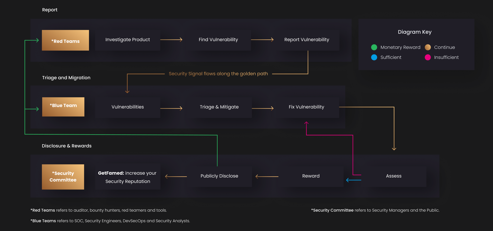

# Hello, world! 

We proudly announce Famed — ***an Open Source Protocol to generate “Fame” - Security Reputation based on CVE-rated public vulnerability disclosure data.***

Famed is currently being developed as a [GitHub App](https://github.com/marketplace/getfamed) with 💜 by [morphysm.io](https://www.morphysm.io/), a Decentralized Community of Security Researchers. ***We believe Software Security is of paramount value of the Ethereum Ecosystem, Web3, the Open Source Community, and all Humans and, therefore, a public good.***

In this first post, we'll review some of our Design Goals and the Motivation of the Famed score and reputation System, how we will create a Decentralized Network for Security Reputation and improve the Security of the Open Source Supply Chain. 

Next, we'll introduce the Famed GitHub App: a suite of CI/CD security-hygiene tools for Threat Modeling, Static- and Dynamic Vulnerability Analysis, and an end-to-end security vulnerability lifecycle management tool, to support customers in their security transformation.

## What is Famed? 

###  Open Source Security Reputation: `Fame for Blue Teamers, Red Teamers, Auditors, Bounty Hunters and Tools`

Security Reputation is a core value of modern Protocols and Applications to create and maintain user Trust. Essentially, Famed is establishing the following relationship:

        Security Reputation += Public Disclosure

#### What we have been working on:

- **Open, asynchronous, transitive Security Reputation:** Famed communicates your commitment, efforts & achievements to secure your Software - within your Organisation, to up&downstream dependencies, your Users, and the Outside World.
- **Blue Team Rewards:** Reward functions incentivize all players (Blue Teamers, Red Teamers, Auditors, Bounty Hunters, and Tools) of the security game to spot & patch vulnerabilities and receive rewards for their efforts.
- **OpSec and Privacy enabled Visibility:** Our security "Walls of Fame" seamlessly see who's on top and who needs to step up their game." everyone involved in the vulnerability lifecycle can see how things are going.
- **Continuous Security Hygiene:** A suite of CI/CD tools for threat modeling, static & dynamic analysis, fuzzing, vulnerability bounties, and code audits. 

To experience it yourself, [getFamed](https://github.com/marketplace/getfamed) for your GitHub Repository. Currently, this is what the Famed App will do for you: 

- A badge to diplay your commitments to Security for your Repository and Website

- A Dynamic Wall of Fame for your Blue Teamers, Red Teamers, Auditors, Bounty Hunters and Tools.

- Optionally: CI/CD Threat Modeling, Automated Static and Dynamic Scans for Security Vulnerabilities, especially for Smart Contracts  

If you would like to learn more about what the Famed App can do for the Security of your Company, Organisation, or Project - follow us on Medium. 

## Why Famed? 
### Securing the Public Supply Chain - Which software stack can you (really) trust?

For Open Source Software, everyone can get a code smell, review public audits, evaluate security hygiene, deeply audit the source code, file a Security Advisory, disclose a Security Bug, or even file a PR to harden a codebase against emerging Threats. 
The reality is, however, that Open Source Maintainers are effectively unpaid outsourcing teams for giant corporations relying on their Code. When the log4j Remote Code Execution Vulnerability was disclosed in 2021, an Alibaba engineer told the log4j team: 'Please hurry up'. Alibaba has a market cap of $348 billion, while a handful of volunteers maintain log4j. 

### Is Security doomed to be a *conflicting objective*? 

In reality, Security done wrong prevents Developers from Developing, Designers from Designing, and Marketers from Marketing by increasing/overflowing FUD, and Cognitive dissonance is straightforward: Let's talk hardware supply chain attacks executed by insider threats. 
In a setup consisting of teams for development, product, UX, marketing, and Security, the teams have the following objectives, sometimes KPIs:

> 
> UX: Design things people will like to use!
> 
> Development: Develop things!
> 
> Product: Make things people will buy!
> 
> Marketing: Make people try out things!
> 
> Security: Secure all the things everyone else is doing 🤷‍♂️
> 

With an ever-accelerating focus on UX, Development velocity, Product Release Velocity, Marketing & Sales, Security is more often a liability than an asset, causing cognitive dissonance and raising questions. 

### What you are signing up for: We are on a mission to Secure Public Goods by making Security an asset instead of a liability. 

Famed will attempt to solve these problems with a decentralized, homomorphic security economy based on recent advances in zero-knowledge proofs and homomorphic encryption. We set out to build a *security prediction market* and a *decentralized security oracle* for the wWb3 and Open Source community with the long-term goal to turn Security into an asset, yielding surplus value to the project, which is generating the underlying security market signal.  

The design goal of this setup is to improve the Security of projects in the FOSS space by aligning the incentives of all parties involved. Famed additionally aims to
- Enable Security Value creation 
- enable understaffed but system-relevant projects (log4j) to get funding to improve their security posture from the community in an incentivized way
- Develop formal incentives and create shared Security Value in the vulnerability lifecycle 
- Generate a clear transparent signal to evaluate the Security of a project 

Essentially, the Famed DAO will develop three core incentive layers: 

1. With a staking mechanism, we create a strong incentive for bounty hunters, auditors, and security tools to find and report vulnerabilities, creating a security signal. 
2. By rewarding developers for every fix of vulnerabilities, we incentivize them with a share in the security value they create.
3. By enabling staking on the homomorphic security signal of each project in a prediction market, we generate a decentralized security oracle, turning the security value of projects into an asset and making that asset publicly visible throughout and outside of their ecosystems. 

### Further Reading:

Retroactive public goods funding https://medium.com/ethereum-optimism/retroactive-public-goods-funding-33c9b7d00f0c

Ethereum and Game Theory https://medium.com/@virgilgr/ethereum-is-game-changing-technology-literally-d67e01a01cf8

Staking beyond consensus https://www.theblockcrypto.com/post/56263/staking-beyond-consensus-decentralized-digital-labor-markets
and for Aave https://docs.aave.com/faq/migration-and-staking#:~:text=Staking%20consists%20of%20depositing%20your,stakers%20will%20receive%20Safety%20Incentives.

Prediction markets https://medium.com/veil-blog/a-guide-to-augur-market-economics-16c66d956b6c https://docs.gnosis.io/conditionaltokens/docs/introduction1/

Crowdsourcing mechanism http://dx.doi.org/10.2139/ssrn.2618837

[comment]: <### Acknowledgements: #ToDo - add advisors and Thanks>

